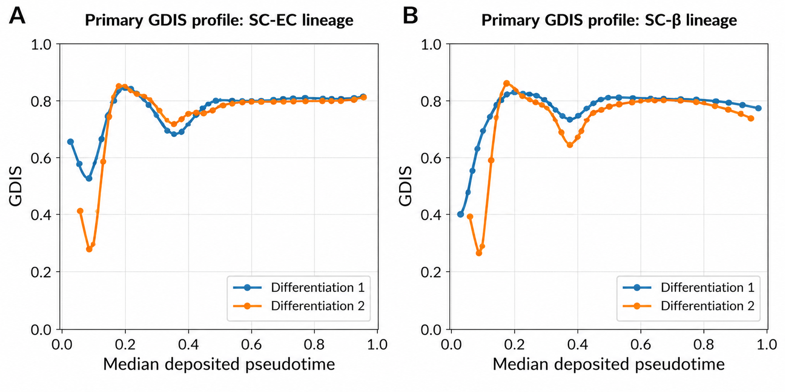
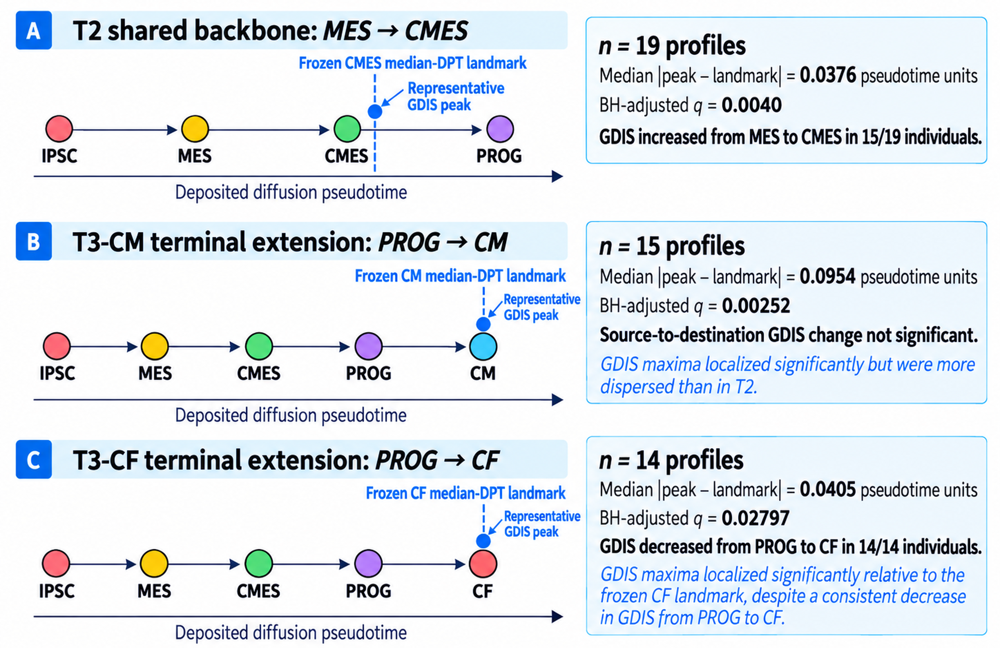
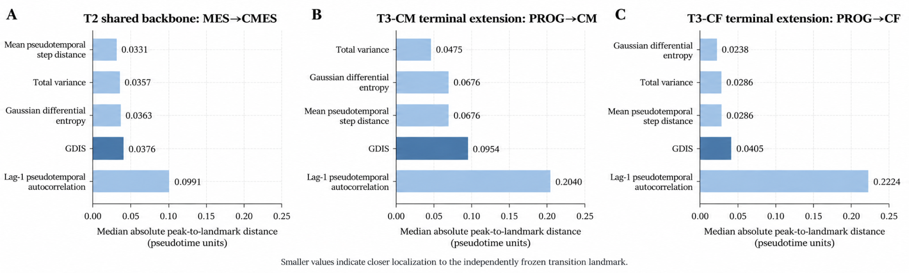

# GDIS-Bio

## A Generalized Dynamical Instability Framework for Localizing Transcriptional State Transitions in Single-Cell Trajectories

**Authors:** Hamid Ismail, Ahmed Harb, Basem William, and Marwan Bikdash

[](environment.yml)
[](https://pypi.org/project/pygdis/)
[](LICENSE)
[](docs/reproducibility_workflow.md)

**Repository:** https://github.com/hamiddi/GDIS-Bio

GDIS-Bio is the complete reproducibility workflow accompanying the manuscript **“GDIS-Bio: A Generalized Dynamical Instability Framework for Localizing Transcriptional State Transitions in Single-Cell Trajectories.”** The repository preserves the analysis sequence from public-data acquisition through preprocessing, trajectory validation, state-space construction, GDIS calculation, sensitivity analysis, conventional benchmarking, structure-preserving null validation, independent external validation, and final evidence freezing.

The framework uses the reference **pyGDIS v1.0.0** implementation and is designed to localize transition-associated instability along pseudotemporally ordered single-cell transcriptional trajectories. GDIS is treated as a complementary integrative measure rather than as a universal replacement for conventional transition statistics.

## At a glance

- **Discovery dataset:** GSE114412, human pancreatic endocrine differentiation.
- **External-validation dataset:** GSE175634, human iPSC-to-cardiac differentiation.
- **Primary state space:** 50 principal components.
- **Primary local trajectory window:** 400 cells with a 100-cell step.
- **Sensitivity analyses:** 5/10/20/30 PCs and 300/75 and 500/125 window configurations.
- **Null validation:** 20,000 structure-preserving circular shifts.
- **Benchmark metrics:** total variance, Gaussian differential entropy, mean pseudotemporal step distance, and lag-1 pseudotemporal autocorrelation.
- **External transfer:** the GDIS formulation and primary analytical settings are applied without dataset-specific retuning.

The repository includes the complete analysis sequence, compact frozen reference outputs, manuscript figures/tables used for traceability, and Linux/macOS and Windows launchers for reproducing the workflow.

## Reproducibility principles

- Biological transition landmarks are defined independently of GDIS.
- Discovery and external-validation designs are frozen before the corresponding GDIS calculation.
- The external dataset is analyzed without dataset-specific GDIS retuning.
- Primary analyses use a 50-PC state space and 400-cell/100-step sliding windows.
- Lower-dimensional PC spaces and 300/75 and 500/125 windows are prespecified sensitivity analyses.
- Overlapping windows are dependent and are not used as independent inferential replicates.
- Pseudotime is interpreted as an ordered developmental coordinate, not physical time.
- No universal biological GDIS threshold is assumed.

## Public datasets

| Role | GEO accession | Biological system | Download stage |
|---|---|---|---|
| Discovery | **GSE114412** | Human stem-cell pancreatic endocrine differentiation | `p1` |
| External validation | **GSE175634** | Human iPSC-to-cardiac differentiation | `p12` |

Raw source files are intentionally not stored in GitHub. The download scripts recreate `raw_data/` from public GEO files. The reference run used approximately **1.14 GB** of compressed raw data.

## Quick start

### 1. Clone

```bash
git clone https://github.com/hamiddi/GDIS-Bio.git
cd GDIS-Bio
```

### 2. Create the environment

```bash
conda env create -f environment.yml
conda activate gdis_bio
python tools/check_environment.py
```

The manuscript reference environment recorded Python 3.11.16, NumPy 2.4.6, pandas 2.3.3, SciPy 1.17.1, Scanpy 1.11.5, AnnData 0.12.19, and pyGDIS 1.0.0. Matplotlib, scikit-learn, and requests are also required; their exact versions were not recorded in the manuscript run reports.

## Computational resources

The workflow is CPU- and memory-intensive, particularly during preprocessing and state-space construction for GSE175634. A GPU is **not required** by the current implementation. The values below are practical recommendations for reproducing the complete workflow rather than strict hardware requirements.

| Resource | Suggested starting point | Recommended for the full workflow | Notes |
|---|---:|---:|---|
| CPU | 8 logical cores | 16–32 logical cores | Several geometry/nearest-neighbor operations use all available cores (`n_jobs=-1`). |
| RAM | 32 GB | 64 GB or more | External preprocessing is the most memory-intensive stage. The GSE175634 analysis includes >217,000 cells and constructs a dense float32 2,000-HVG matrix for PCA in addition to sparse count matrices and AnnData objects. |
| Free disk space | 10 GB | 20 GB or more | The reference raw-data download is ~1.06 GiB compressed and the frozen results tree was ~1.39 GiB; additional space is needed temporarily for decompression and intermediate files. |
| GPU | Not required | Not required | The manuscript workflow is CPU-based. |
| Internet | Required for initial download | Broadband recommended | `p1` and `p12` download the public GEO source files. |

**Operating systems.** The scripts use repository-relative paths and Python `pathlib`. Linux/HPC is recommended for the complete high-memory workflow, while Windows is supported through `run_all.ps1`. From Windows Command Prompt, the PowerShell launcher can be invoked with:

```cmd
powershell -ExecutionPolicy Bypass -File .\run_all.ps1
```

**Runtime.** Wall-clock time was not systematically benchmarked because it depends strongly on CPU count, storage speed, available memory, and network performance. Users with limited resources can execute the pipeline stage-by-stage and reuse completed intermediates rather than rerunning the full workflow.

### Data and intermediate-file footprint

Large public inputs and computational intermediates are intentionally excluded from GitHub. The supplied download and analysis scripts recreate them locally. In the manuscript reference run:

- compressed public raw data occupied approximately **1.06 GiB**;
- the complete results tree occupied approximately **1.39 GiB**;
- the largest external-validation preprocessing steps require additional temporary memory and storage beyond these final footprints.

For this reason, **20 GB or more of free local storage and 64 GB RAM are recommended** for a comfortable full rerun. Partial analyses and downstream stages may require substantially less.

### 3. Run the full pipeline

Linux/macOS:

```bash
bash run_all.sh
```

Windows PowerShell:

```powershell
powershell -ExecutionPolicy Bypass -File .\run_all.ps1
```

The full workflow is computationally intensive and produces large intermediate matrices that are intentionally excluded from GitHub. See [`docs/reproducibility_workflow.md`](docs/reproducibility_workflow.md) for the complete stage-by-stage description.

### Run selected stages

Each analysis stage can also be executed independently once its upstream inputs exist. For example:

```bash
python scripts/p1_download_data.py
python scripts/p5_preprocessing_state_space.py
python scripts/p8_gdis_primary_analysis.py
python scripts/p12_download_preflight_GSE175634.py
python scripts/p18_GSE175634_primary_external_gdis.py
```

This is useful for development, troubleshooting, or reproducing only a specific manuscript result. The required upstream dependencies for every stage are documented in [`docs/reproducibility_workflow.md`](docs/reproducibility_workflow.md).

## Pipeline

| Stage | Analysis |
|---|---|
| `p1`–`p4b` | Discovery data download, characterization, and trajectory/replicate validation |
| `p5`–`p7` | Discovery preprocessing, state-space validation, and window assembly |
| `p8`–`p11` | Primary discovery GDIS, biological validation, conventional benchmark, and null testing |
| `p12`–`p17b` | External data download, characterization, design freeze, preprocessing, geometry validation, and evaluability freeze |
| `p18`–`p23` | Primary external GDIS, statistical validation, sensitivity, conventional benchmark, paired comparisons, and evidence freeze |

A detailed script-by-script map is available in [`docs/reproducibility_workflow.md`](docs/reproducibility_workflow.md).

## Key manuscript results

### Discovery: pancreatic endocrine differentiation



GDIS localized the major early endocrine transition near the independently defined NEUROG3-early region across both endocrine branches and both differentiation replicates.

### External validation



The frozen framework transferred to GSE175634 without dataset-specific retuning and showed significant localization for the shared MES→CMES transition and the terminal PROG→CM and PROG→CF transitions.

### External benchmark



Conventional variance, entropy, and pseudotemporal step-distance measures were competitive with or better than GDIS in several external settings. GDIS showed its clearest comparative advantage over lag-1 pseudotemporal autocorrelation in the terminal transitions.

<details>
<summary><strong>Supplementary Table S11 — external benchmark and paired statistical comparisons</strong></summary>

| Transition | Metric | Median absolute distance | Rank | GDIS W/T/L | Sign-test p | Wilcoxon p |
|---|---|---:|---:|---:|---:|---:|
| T2: MES→CMES | GDIS | 0.0376 | 4 | —/—/— | — | — |
| T2: MES→CMES | Total variance | 0.0357 | 2 | 11/4/4 | 0.05923 | 0.2661 |
| T2: MES→CMES | Gaussian differential entropy | 0.0363 | 3 | 12/3/4 | 0.03841 | 0.1388 |
| T2: MES→CMES | Mean pseudotemporal step distance | 0.0331 | 1 | 10/3/6 | 0.2272 | 0.3025 |
| T2: MES→CMES | Mean lag-1 pseudotemporal autocorrelation | 0.0991 | 5 | 14/1/4 | 0.01544 | 0.01733 |
| T2: MES→CMES | GDIS transition energy | 0.2587 | 6 | 18/1/0 | 3.815e-06 | 9.822e-05 |
| T3-CM: PROG→CM | GDIS | 0.0954 | 4 | —/—/— | — | — |
| T3-CM: PROG→CM | Total variance | 0.0475 | 1 | 5/1/9 | 0.9102 | 0.938 |
| T3-CM: PROG→CM | Gaussian differential entropy | 0.0676 | 2 | 3/1/11 | 0.9935 | 0.9871 |
| T3-CM: PROG→CM | Mean pseudotemporal step distance | 0.0676 | 2 | 3/1/11 | 0.9935 | 0.976 |
| T3-CM: PROG→CM | Mean lag-1 pseudotemporal autocorrelation | 0.2040 | 5 | 12/1/2 | 0.00647 | 0.003159 |
| T3-CM: PROG→CM | GDIS transition energy | 0.3982 | 6 | 15/0/0 | 3.052e-05 | 3.052e-05 |
| T3-CF: PROG→CF | GDIS | 0.0405 | 4 | —/—/— | — | — |
| T3-CF: PROG→CF | Total variance | 0.0286 | 2 | 3/1/10 | 0.9888 | 0.9421 |
| T3-CF: PROG→CF | Gaussian differential entropy | 0.0238 | 1 | 4/0/10 | 0.9713 | 0.971 |
| T3-CF: PROG→CF | Mean pseudotemporal step distance | 0.0286 | 2 | 3/2/9 | 0.9807 | 0.932 |
| T3-CF: PROG→CF | Mean lag-1 pseudotemporal autocorrelation | 0.2224 | 5 | 13/0/1 | 0.0009155 | 0.0003052 |
| T3-CF: PROG→CF | GDIS transition energy | 0.3000 | 6 | 9/3/2 | 0.03271 | 0.003823 |

The full machine-readable table is available at [`manuscript_assets/tables/Supplementary_Table_S11.csv`](manuscript_assets/tables/Supplementary_Table_S11.csv), and the manuscript-formatted table is available as [`Supplementary_Table_S11.docx`](manuscript_assets/tables/Supplementary_Table_S11.docx).

</details>

## Repository layout

```text
GDIS-Bio/
├── README.md
├── environment.yml
├── requirements.txt
├── run_all.sh
├── run_all.ps1
├── scripts/
├── tools/
├── config/
├── raw_data/
├── results/
│   └── reference_outputs/
├── manuscript_assets/
│   ├── figures/
│   └── tables/
└── docs/
```

`results/reference_outputs/` contains compact tables and reports from the frozen manuscript run so that regenerated outputs can be compared against the reference analysis. Large `.h5ad`, state-space, and trajectory-array intermediates are regenerated by the workflow and are not tracked.

## Reproducibility checks

Before running the analysis, verify the software environment with:

```bash
python tools/check_environment.py
```

After a rerun, compare regenerated summary tables and reports against `results/reference_outputs/`. The repository preserves compact reference evidence specifically so that important manuscript values can be audited without distributing the full multi-gigabyte intermediate results tree.

For publication or archival use, we recommend recording the Git commit hash or a tagged release together with the manuscript so that the exact analysis version remains identifiable.

## Manuscript-to-code traceability

See [`docs/manuscript_mapping.md`](docs/manuscript_mapping.md) for the mapping between Figures 6–10, Supplementary Figures S4–S5, Supplementary Table S11, the generating analysis stages, and the corresponding reference tables.

## Interpretation boundaries

GDIS-Bio operates on pseudotemporally ordered independent cells. The output therefore characterizes changes in transcriptional state-space geometry along a developmental ordering and should not be interpreted as direct physical-time dynamics of the same cells, exact prediction of transition onset, proof of deterministic chaos, or proof of a classical biological attractor or bifurcation.

## Software

The primary GDIS calculations use **pyGDIS 1.0.0**, imported as `gdis` by the analysis scripts.

- pyGDIS: https://pypi.org/project/pygdis/
- pyGDIS source: https://github.com/hamiddi/pygdis

## Citation

If you use this workflow, please cite the accompanying GDIS-Bio manuscript and this repository. GitHub-compatible citation metadata are provided in [`CITATION.cff`](CITATION.cff).

## Questions and issues

For reproducibility questions, unexpected software behavior, or problems recreating a manuscript output, please open an issue in the [GitHub issue tracker](https://github.com/hamiddi/GDIS-Bio/issues). When possible, include the operating system, Python/Conda environment, analysis stage, and the relevant log or error message.

## License

This repository is distributed under the **MIT License**. See [`LICENSE`](LICENSE).
